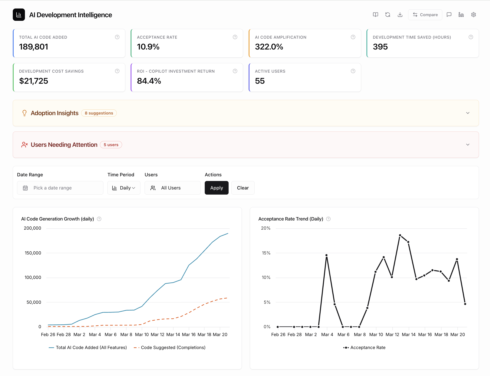
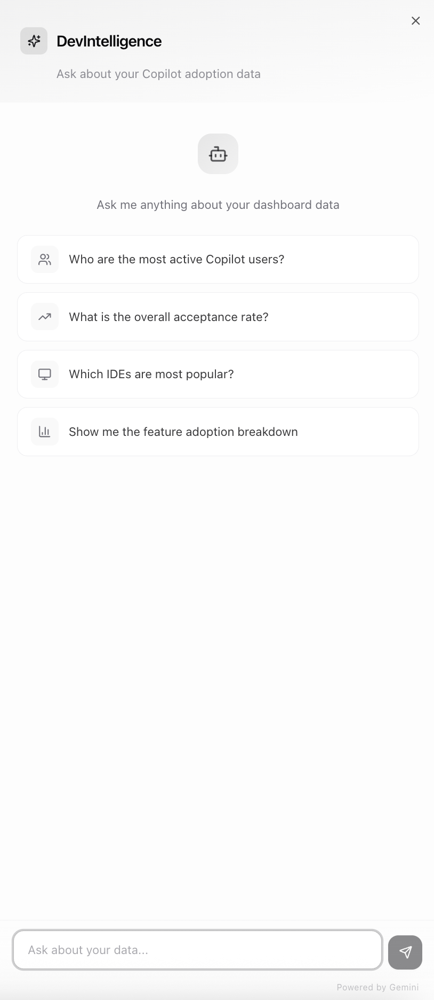

# AI Development Intelligence Dashboard

A modern analytics dashboard for tracking GitHub Copilot adoption and ROI across your engineering team. Upload one or more Copilot usage exports to build historical data beyond 28 days, or connect directly to the GitHub Enterprise API — with an AI-powered chat assistant to explore your data conversationally.



---

## Table of Contents

- [Features](#features)
- [Screenshots](#screenshots)
- [Getting Started](#getting-started)
- [Environment Variables](#environment-variables)
- [Available Scripts](#available-scripts)
- [Configuration](#configuration)
- [Project Structure](#project-structure)
- [Tech Stack](#tech-stack)

---

## Features

### 📊 Metrics at a Glance
- **Total AI Code Added** — lines accepted through Copilot workflows
- **Acceptance Rate** — developer trust in AI suggestions
- **AI Code Amplification** — ratio of code added vs. suggested (can exceed 100%)
- **Development Time Saved** — estimated hours saved (configurable coding speed)
- **Development Cost Savings** — dollar value based on configurable hourly rate
- **ROI – Copilot Investment Return** — savings vs. license cost
- **Active Users** — total unique users in the dataset

### 📈 17 Interactive Charts
- AI Code Generation Growth — daily code added (bars) + cumulative total (line) on dual axes
- Acceptance Rate Trend
- Model Usage Distribution (GPT-4o, Claude, etc.)
- Feature Usage Breakdown (chat, agent, completions, CLI, plan mode)
- Model Effectiveness Comparison
- Code Churn Analysis
- Average Interactions Trend
- IDE Distribution (pie chart)
- Programming Language Treemap
- Agent Adoption Trend
- Language × Feature Matrix (heatmap)
- Engagement Heatmap — click any cell to see active users
- Day-of-Week Activity — toggle between All Data and Last 7 Days; click a bar to see users (Last 7 Days mode)
- IDE Version Tracking
- Top Contributors Leaderboard with performance segments

All charts are powered by **Highcharts**, support responsive layouts, and respect the current light/dark theme.

### 🤖 AI Chat Assistant (DevIntelligence)

An integrated AI chat panel where you can ask **any question** about your Copilot adoption data in natural language. The assistant understands your full dataset and can answer anything from high-level summaries to specific user-level breakdowns.

A few example prompts to get started:

- *"Who are the most active Copilot users?"*
- *"What is the overall acceptance rate?"*
- *"Which IDEs are most popular?"*
- *"Show me the feature adoption breakdown"*
- *"Compare agent mode usage across teams"*
- *"Which users have low acceptance rates and why?"*

Powered by **Google Gemini** with real-time streaming responses. The assistant receives your dashboard data as context and compares metrics against industry benchmarks automatically. Responses are rendered with markdown formatting and streamed in real time.

### 🎨 Stitch Design Integration

The project includes a **Stitch MCP integration** for design-to-code workflows:

- Design screens in [Stitch](https://stitch.withgoogle.com/) and convert them to React/TypeScript components
- Sync finalized local code back to Stitch (bidirectional)
- Generate design variants via MCP functions
- Pixel-faithful translation with no unauthorized UI enhancements

### 🔍 Advanced Analysis
- **Adoption Insights Panel** — automated suggestions for underused features (< 30% adoption), with champion users highlighted per feature
- **Non-Adopter Analysis** — identifies users with low engagement, sporadic activity, or missing features
- **User Profile Cards** — click any user to see their preferred model, IDE (with latest version), top languages, acceptance rate, features used, and active days
- **User Comparison** — compare 2–5 users side by side across all metrics (key stats, modes, IDEs, models, languages, features)
- **Performance Segments** — Champion, Producer, Explorer, Starter classifications

### 📂 Multi-File Upload & Data Persistence
- **Upload multiple exports** — drag & drop several `.ndjson` files at once to combine data from different time periods
- **Smart merge** — automatically deduplicates rows on `(user_login, day)`; newer rows win on overlap
- **localStorage auto-save** — your data is saved locally and restored on next visit; no need to re-upload each session
- **Import More Data** — add additional exports from the dashboard header without leaving the dashboard
- **Export merged data** — download your accumulated dataset as a single `.ndjson` file for backup or sharing
- **Data Storage management** — view row count, date range, storage size in Settings; clear saved data when needed

> **Tip:** GitHub Copilot exports only the last 28 days. Upload exports from different months to build a complete historical view.

### 🎛️ Filters & Settings
- **Date range picker** — filter data to a specific time window
- **User selector** — multi-select to focus on specific users
- **Aggregation period** — daily, weekly, or monthly grouping
- **Configurable metrics** — team coding speed (lines/min), developer hourly rate, Copilot license cost
- **Chart visibility toggles** — show/hide any of the 17 charts individually
- **Export** — save the full dashboard as a PNG image

### 🎨 Theming
- Full **dark mode** support with a one-click toggle in the header
- Theme preference is persisted across sessions

### 📖 Interactive Dashboard Guide
- Built-in guide explaining every metric, chart, and KPI
- Includes formulas, interpretation guidance, caveats, and recommended actions
- Navigate directly to any topic from the header

---

## Screenshots

### Dashboard Overview


### AI Chat Panel


---

## Getting Started

### Prerequisites

- [Node.js](https://nodejs.org/) 18+

### Installation

```bash
git clone https://github.com/amitrok1/remix-of-github-adoption-insights.git
cd remix-of-github-adoption-insights
npm install
```

### Running Locally

```bash
npm run dev
```

This starts the Vite dev server at `http://localhost:8080`.

### Option A: Upload Data Manually

No configuration needed — just start the app and drag & drop one or more GitHub Copilot admin exports (`.ndjson` or `.json` files) into the upload area. All data is processed locally in your browser. Upload multiple exports from different time periods to build data beyond the 28-day API limit. Your data is automatically saved to `localStorage` and restored on your next visit.

### Option B: Auto-Fetch from GitHub Enterprise API

Create a `.env.local` file in the project root (see [Environment Variables](#environment-variables)):

```env
VITE_GITHUB_ENTERPRISE=your-enterprise-slug
GITHUB_BASE_URL=https://api.your-enterprise.ghe.com
GITHUB_PAT=ghp_your_personal_access_token
```

With these set, `npm run dev` and `npm run build` will automatically fetch the latest 28-day Copilot metrics report and write it to `public/copilot_data.ndjson`. The app then loads this file on startup.

> **Note:** The GitHub Copilot Metrics API has a ~2 day processing delay. Data for today/yesterday may not be available yet.

#### Required PAT Permissions

Your Personal Access Token needs:
- `manage_billing:copilot` (or enterprise admin access)
- Read access to the Copilot usage reports endpoint

---

## Environment Variables

Create a `.env.local` file in the project root. No variables are required — the app works with manual file upload out of the box.

| Variable | Side | Default | Description |
|----------|------|---------|-------------|
| `VITE_GITHUB_ENTERPRISE` | Client | — | Enterprise slug; when set, the app auto-fetches data from the GitHub API on load |
| `GITHUB_BASE_URL` | Server | — | GitHub Enterprise API base URL (e.g. `https://api.github.com` or your GHE URL) |
| `GITHUB_PAT` | Server | — | Personal Access Token with `manage_billing:copilot` scope |
| `GEMINI_API_KEY` | Server | — | Google Gemini API key; enables the AI chat assistant. Get one at [Google AI Studio](https://aistudio.google.com/apikey) |
| `CHAT_MODEL` | Server | `gemini-2.0-flash` | Gemini model to use for chat responses |
| `STITCH_API_KEY` | Server | — | Stitch MCP API key; enables design-to-code integration with [Stitch](https://stitch.withgoogle.com/) |

**Example `.env.local`:**

```env
# GitHub Enterprise API (optional — for auto-fetching data)
VITE_GITHUB_ENTERPRISE=your-enterprise-slug
GITHUB_BASE_URL=https://api.your-enterprise.ghe.com
GITHUB_PAT=ghp_your_personal_access_token

# AI Chat (optional — enables DevIntelligence chat panel)
GEMINI_API_KEY=your-gemini-api-key
CHAT_MODEL=gemini-2.0-flash

# Stitch MCP (optional — enables design-to-code integration)
STITCH_API_KEY=your-stitch-api-key
```

---

## Available Scripts

| Script | Command | Description |
|--------|---------|-------------|
| **dev** | `npm run dev` | Fetch data (if configured) and start the Vite dev server |
| **build** | `npm run build` | Fetch data and create a production build in `dist/` |
| **build:dev** | `npm run build:dev` | Build in development mode (unminified, with source maps) |
| **preview** | `npm run preview` | Preview the production build locally |
| **fetch-data** | `npm run fetch-data` | Fetch Copilot data from the GitHub API without starting the server |
| **lint** | `npm run lint` | Run ESLint across the project |

---

## Configuration

### Dashboard Settings

Open the settings panel via the gear icon in the dashboard header. All settings are persisted to `localStorage`.

| Setting | Default | Description |
|---------|---------|-------------|
| **Team Coding Speed** | 10 lines/min | Used to calculate Development Time Saved. Adjust based on your team's average. |
| **Developer Hourly Rate** | $55/hr | Used for cost savings calculation. US average ~$55; adjust for your region. |
| **Copilot License Cost** | $39/user/month | Monthly per-seat cost. Business plan: $19, Enterprise: $39. |

### Chart Visibility

All 17 charts are visible by default. Toggle individual charts on/off from the settings panel, or use **Show All / Hide All** for bulk control. Visibility preferences persist across sessions.

### Aggregation Periods

Use the **Time Period** filter to switch between:
- **Daily** — most granular; best for spotting day-to-day trends
- **Weekly** — smooths out daily variance; good for sprint reviews
- **Monthly** — high-level overview; best for executive reporting

> **Note:** The Day-of-Week Activity chart is only available in daily aggregation mode.

---

## Project Structure

```
├── .github/
│   ├── agents/                 # Copilot agent definitions
│   └── skills/                 # Copilot skill definitions (Stitch, etc.)
├── public/
│   ├── copilot_data.ndjson     # Auto-generated data file (gitignored)
│   └── robots.txt
├── scripts/
│   └── fetch-copilot-data.mjs  # Build-time GitHub API data fetcher
├── server/
│   ├── promptBuilder.ts        # AI chat system prompt with benchmarks
│   ├── vite-plugin-chat.ts     # Vite plugin: /api/chat SSE endpoint
│   └── providers/
│       ├── gemini.ts           # Google Gemini streaming provider
│       └── types.ts            # Provider type definitions
├── src/
│   ├── pages/                  # Route pages (Index, NotFound)
│   ├── components/
│   │   ├── common/             # Shared: MetricCard, ChartContainer, PrivacyFooter
│   │   ├── dashboard/
│   │   │   ├── charts/         # All 17 chart components
│   │   │   ├── filters/        # Date range, user, aggregation filters
│   │   │   ├── ChatPanel.tsx   # AI chat assistant UI
│   │   │   ├── DashboardHeader.tsx
│   │   │   ├── DashboardMetrics.tsx
│   │   │   ├── DashboardCharts.tsx
│   │   │   ├── DashboardFilters.tsx
│   │   │   ├── DashboardSettings.tsx
│   │   │   ├── InsightsPanel.tsx
│   │   │   ├── UserProfileCard.tsx
│   │   │   ├── UserCompareDialog.tsx
│   │   │   ├── ExportButton.tsx
│   │   │   └── ExampleShowcase.tsx
│   │   ├── landing/            # Landing page with upload zone
│   │   └── ui/                 # shadcn/ui primitives (50+ components)
│   ├── hooks/
│   │   ├── useChat.ts          # AI chat state management
│   │   ├── useDashboardData.ts # Data loading & transformation
│   │   ├── useDataFiltering.ts # Filter logic (date, users, aggregation)
│   │   ├── useFileUpload.ts    # Multi-file upload, merge & API fetch logic
│   │   ├── use-mobile.tsx      # Responsive breakpoint hook
│   │   └── use-toast.ts        # Toast notification hook
│   ├── contexts/
│   │   ├── SettingsContext.tsx  # Global settings (metrics, theme, chart visibility)
│   │   └── DashboardGuideContext.tsx # Interactive guide state
│   ├── services/
│   │   ├── chatApi.ts          # Chat API client (SSE streaming)
│   │   ├── githubApi.ts        # GitHub data loading service
│   │   └── analytics.ts        # Google Analytics event tracking
│   ├── utils/
│   │   ├── chartHelpers.ts     # Chart formatting utilities
│   │   ├── chatContextBuilder.ts # Builds data context for AI chat
│   │   ├── dataAggregation.ts  # Weekly/monthly aggregation logic
│   │   ├── exportUtils.ts      # Dashboard PNG export
│   │   ├── metricsCalculator.ts # KPI calculation engine
│   │   ├── ndjsonParser.ts     # NDJSON file parser with multi-file merge
│   │   └── dataStorage.ts      # localStorage persistence layer
│   ├── config/
│   │   └── chartConfigs.ts     # Highcharts theme & base configurations
│   └── content/
│       └── dashboardGuide.ts   # In-app guide content & definitions
├── vite.config.ts              # Vite config (port 8080, SWC, chat plugin)
├── tailwind.config.ts          # Tailwind CSS configuration
├── tsconfig.json               # TypeScript configuration
└── package.json
```

---

## Tech Stack

| Category | Technology |
|----------|-----------|
| Framework | [React](https://react.dev/) 18 |
| Build Tool | [Vite](https://vite.dev/) with SWC |
| Language | [TypeScript](https://www.typescriptlang.org/) |
| Styling | [Tailwind CSS](https://tailwindcss.com/) |
| UI Components | [shadcn/ui](https://ui.shadcn.com/) + [Radix UI](https://www.radix-ui.com/) |
| Charts | [Highcharts](https://www.highcharts.com/) |
| AI Chat | [Google Gemini](https://ai.google.dev/) (streaming via SSE) |
| Design-to-Code | [Stitch](https://stitch.withgoogle.com/) via MCP |
| Data Fetching | [TanStack Query](https://tanstack.com/query) |
| Forms | [React Hook Form](https://react-hook-form.com/) + [Zod](https://zod.dev/) |
| Routing | [React Router](https://reactrouter.com/) |
| File Upload | [react-dropzone](https://react-dropzone.js.org/) |
| Export | [html2canvas](https://html2canvas.hertzen.com/) |
| Theming | [next-themes](https://github.com/pacocoursey/next-themes) |
| Notifications | [Sonner](https://sonner.emilkowal.dev/) |
| Runtime | [Node.js](https://nodejs.org/) 18+ |

---

## Privacy & Data Flow

This dashboard is designed with privacy in mind. Here is exactly what happens with your data:

| Data flow | Where it goes | When |
|-----------|---------------|------|
| Uploaded NDJSON/JSON files | Stays in your browser (no server upload) | Always |
| Dashboard rendering & charts | Local browser only | Always |
| Chat questions + aggregated data summary | Google Gemini API | Only when you use the AI chat feature (dev server only) |
| Page views & UI interactions | Google Analytics | Always (anonymized, no personal data) |

**Important notes:**
- Raw NDJSON data is **never** sent to any external service.
- The AI chat feature sends a **summarized statistical context** (not raw records) to the Gemini API so it can answer your questions. This runs through a local Vite dev server proxy — your API key never reaches the browser.
- Google Analytics tracks anonymized usage events (page views, filter usage, exports). No file contents or user data from your Copilot metrics are sent to GA.

---

## License

This project is licensed under the [MIT License](LICENSE).
